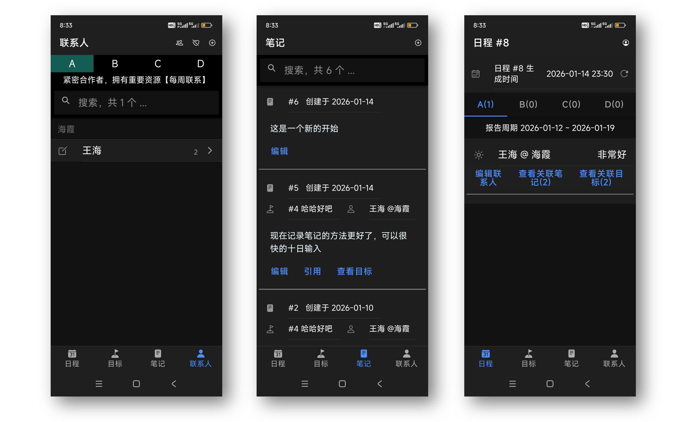
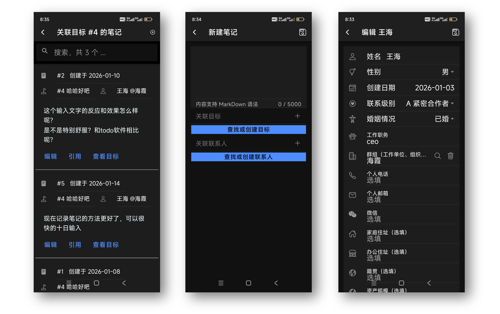
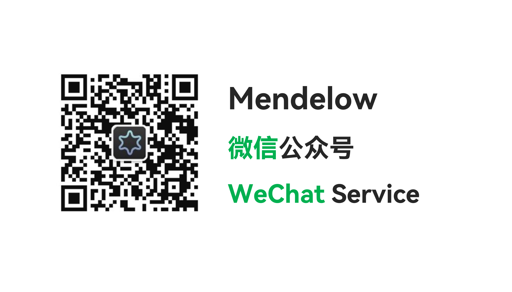
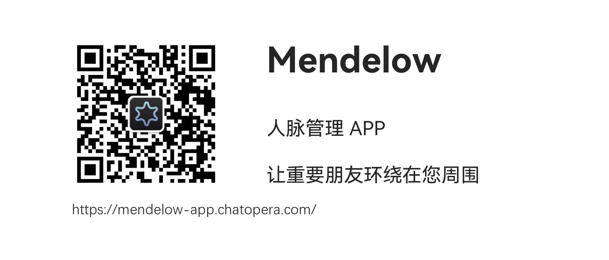

# 我们需要更好的维护朋友、伙伴关系

随着年龄的增长，人际关系变得越来越重要，空闲的时候，打开通信录，我该联系谁？有多少曾经的伙伴很久没有联系了，有多少朋友没有近期的消息了？

多一个朋友就多一条路，当短视频占满了我们休息的时间，我们就应该想一想，打一个电话给远方的朋友不是更好吗~

问题是：打给谁？

<!-- more -->

现代心理学调查显示，人的焦虑主要来自于人际关系的压力。我曾经在微信上加了 3,000+ 的联系人，当翻阅通讯录时和浏览朋友圈时，我的大脑会被这些信息塞满，可是这些信息究竟“和我有什么关系？”，大部分信息都是低价值的 - **手机，微信更是联系工具，而不是联系人管理工具；微信朋友圈是猎奇工具、是庞杂的原始信息**。

# 如何更好的联系

## 设想需求

如何更好的管理和朋友、伙伴之间的关系，是个重要的话题。手机、微信是通讯工具，可是该联系谁，为什么联系，联系后的记录，这些都应该**数字化**，因为人的大脑不善于记忆，而是善于联想和关联。数字化以后，通过软件搜索功能，解放大脑。**所以，我们需要一个手机 APP，可以随时随地的记录。**

然后，基于这些**数字化**的记录，我们可以得到一些提示，最好是待联系的朋友列表，我们开始联系。我们也可以借助人工智能，来生成更多联系策略，给我们更多优化关系的启发。

同时，我们的联系是有**目的**的，比如寻找更好的跳槽岗位。作为成年人，我们的社会关系，影响我们的收入、社会地位，我们交朋友是形成互助的、有利益相关的共同体。

联系还需要以一定**频率**展开，并且我们的精力、时间都是有限的，必须科学合理的开展关系维护。

## 需要一个专用 APP

因为要记录**联系人信息**、记录**目标**、记录**联系笔记**，那么它可以是一个专用软件，因为使用 Word、Wiki、Notion、Obsidian 这些文档笔记类软件，是通用的。<ins>我们必须用一个专用的软件来提升效率，否则工作量太大，习惯能养成，在于完成习惯很简单</ins>。

我写这篇文章的目的，就在于向大家介绍我刚刚发布的一个 APP - Mendelow，而我之所以开发 Mendelow，是因为在尝试了不同的数字化方案后，体验都不好。

### 现有的方案

- 2018 年以前，我记得是使用笔记本（真正的纸和笔）和 Evernote 记录。
- 2018 年以后，我使用笔记本（真正的纸和笔）和 Confluence Wiki 记录，Confluence Wiki 功能强大，可以插入表格，使用模板等。
- 2022 年以后，使用 Obsidian，并且进行了数千行（可能接近 1 万行）代码的开发，形成了自动化分析和自动化日程安排。

不同方案的问题主要是：记录麻烦，这些工具本质上，要么是一个个文本，要么还是 Table 列表；或者是只能在电脑上用，在手机上编辑和排版都不好。

我也在安卓应用商店找了几款【个人人脉管理 APP】，【联系人管理 APP】，都和我设想的有差距。

### 不得已开发一个 APP

真正刺激我，让我完善联系人管理方法的时刻，是我学习了一篇文章介绍【Mendelow Stakeholders Matrix】理念以后，在管理学中，这是很知名的一个理论，在网络上，有很多文章，在此不展开。其精髓，就是先对联系人进行标记，然后分优先级开展联系。

从 2022 年使用 Obsidian 以来，就是想要实践 Mendelow 的联系人管理理念，但是一直没有好的工具帮我养成习惯。在脑海中思考了很久之后，我在 2025 年 12 月开始开发这款 APP，而这款 APP 的名字就是 Mendelow。

# 分享 Mendelow 的目的

我觉得自己不是一个很善于社交的人，我更喜欢思考和创造。**但是随着进入中年，我必须努力维护好伙伴关系，Mendelow APP 的目的是，让我更好的去和朋友、伙伴交流。同时，我也觉得，很多人也需要这样一个 APP，于是我分享给大家使用。**

Mendelow APP 目前开始运营，现在是免费的，同时我也承诺，基础功能会一直免费：包括笔记管理、目标管理、联系人管理等。**在随着使用用户增多，我们的运营成本也上升，届时推出一些高级付费功能，所以大家放心使用。**

## 体验 & 使用

Mendelow APP 目前有网页版、安卓 APP 和微信公众号。

首先，推荐读者扫一扫关注下面的微信公众号，您在微信公众号内可以使用 Mendelow 并且接收更多产品更新信息~

在微信公众号菜单，可以进入网页版，完成注册，登录后，可获得更多使用提示。

* 网页版可以在电脑上使用： https://mendelow-app.chatopera.com/
* 安卓 APP 目前通过手机浏览器下载 APK 安装：[链接](https://dwz.chatopera.com/64X44z)
* 反馈：欢迎通过 [链接](https://www.chatopera.com/files/miscs/wx_chatoperacs_humanagent.png) 提供您的宝贵建议

