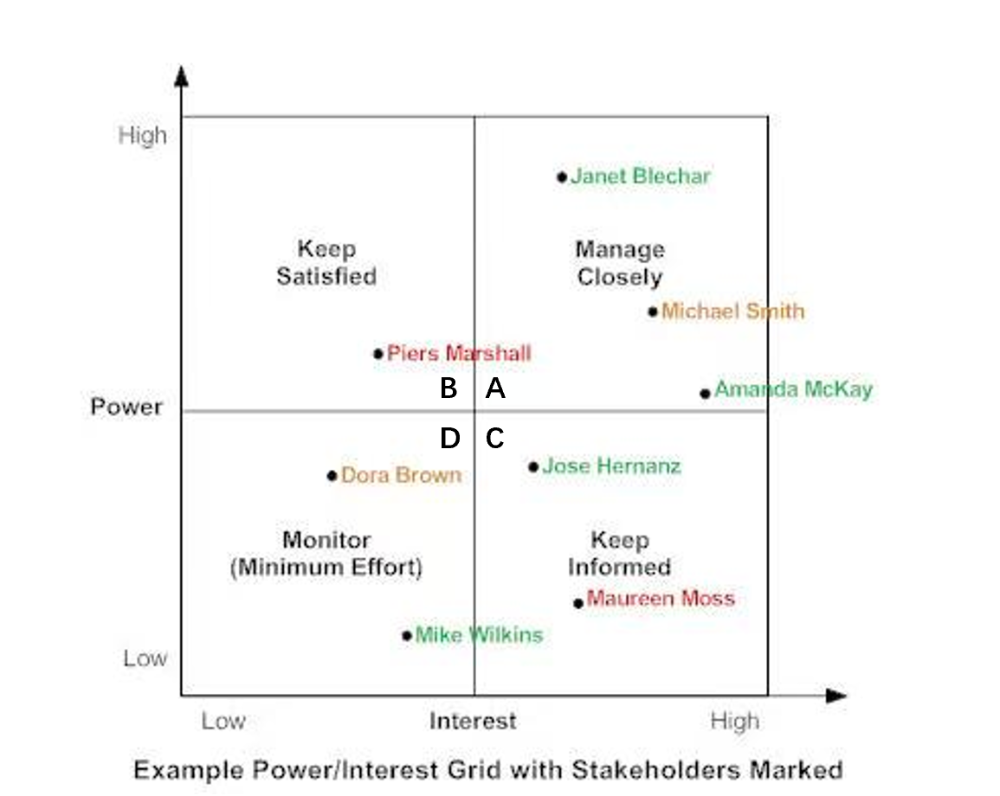
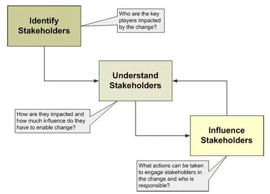
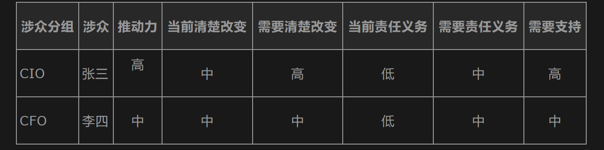
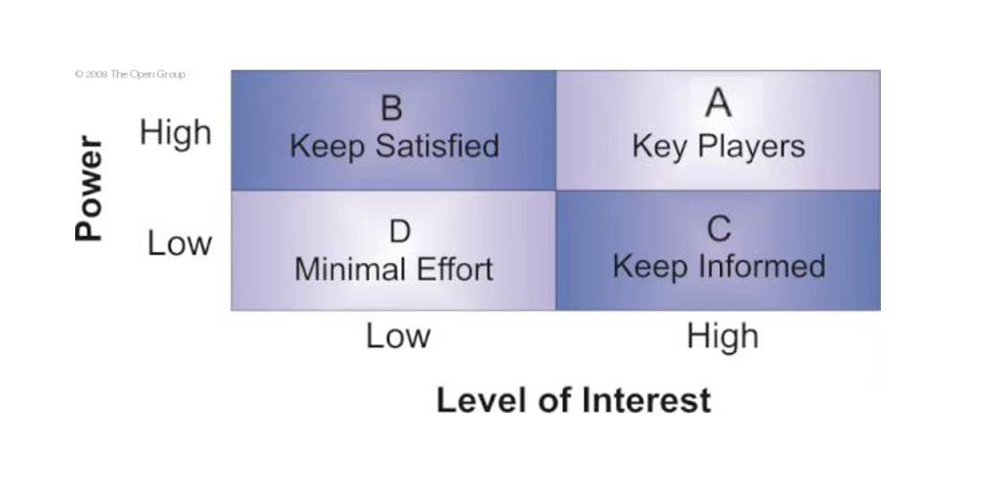
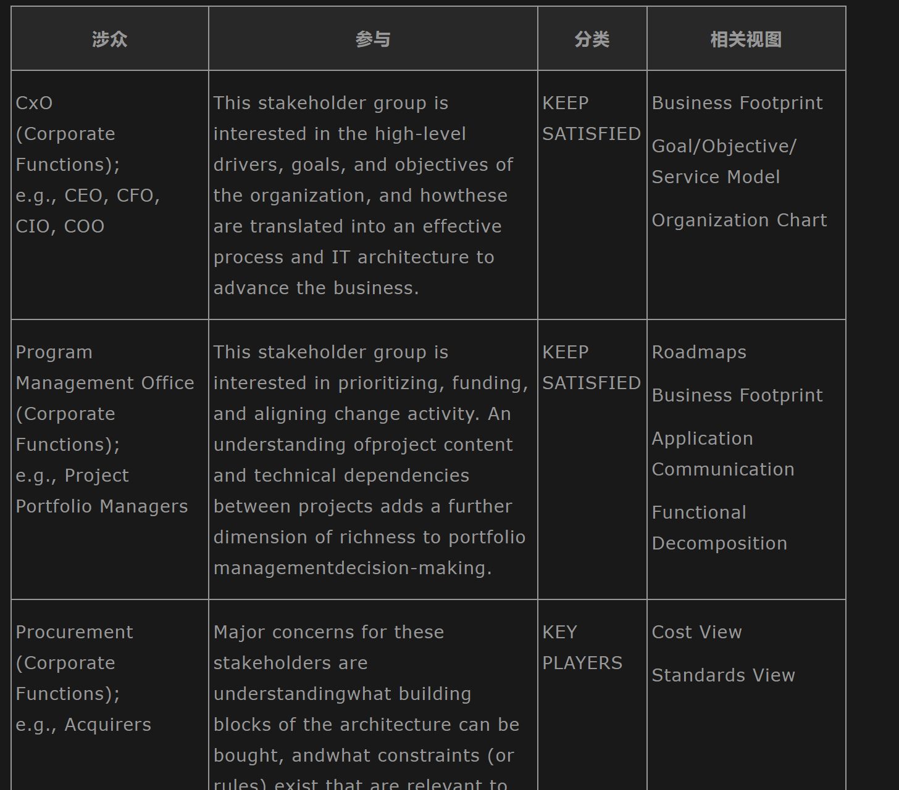
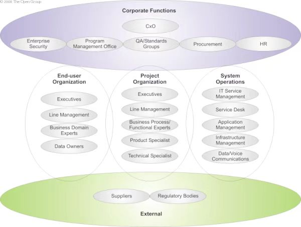
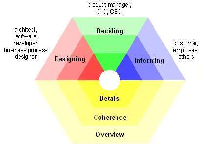
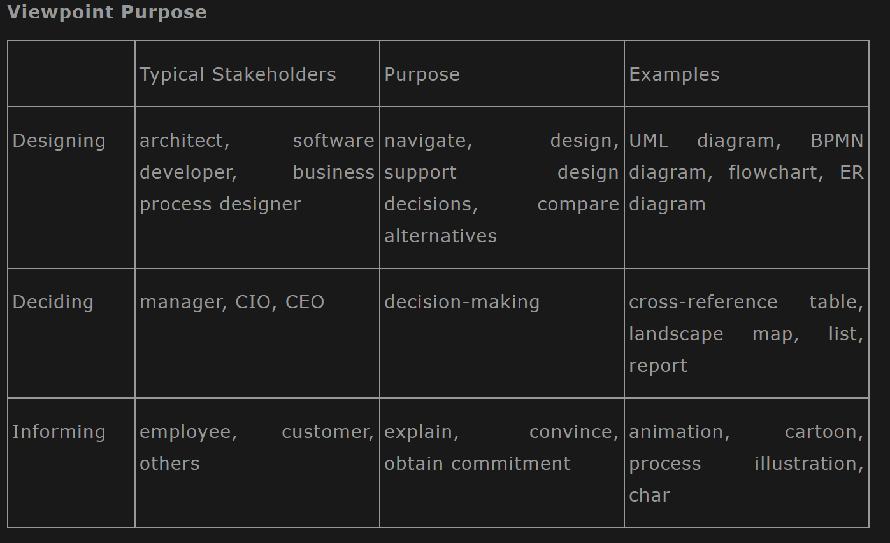
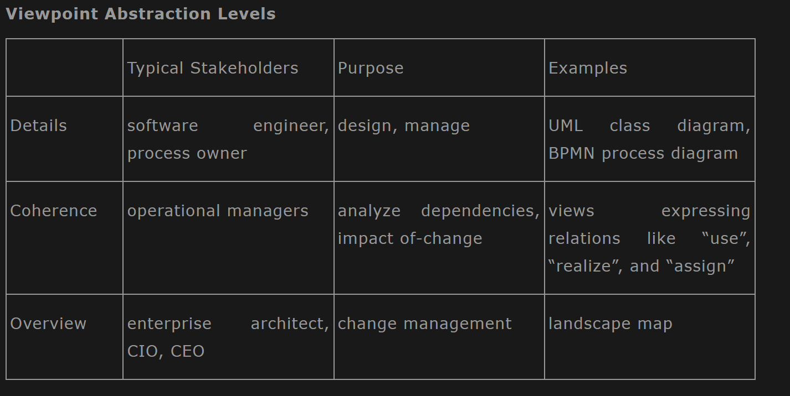

# 涉众管理

复杂系统的复杂不仅在与架构开发流程本身，还与是否获得大范围涉众的一致同意有关，涉众管理的好不能肯定企业架构一定做得好，但是涉众管理做得不好，企业架构肯定做不好。对于管理类型项目来说，客户的满意度有时就能体现出我们和客户一开始交流得够不够。在 A 阶段（架构愿景）中我们需要进行涉众管理，交付类似下图的 Stakeholder Map Matrix。本篇介绍一下涉众管理。

<!-- more -->

# 好处

1. 标识重要的涉众，能在早期更好的框定架构需求和范围

2. 通过重要涉众的支持，可以获取更多的资源

3. 早期频繁的和涉众沟通，可以确保更完整的理解架构流程

# 管理流程

## 获取涉众列表

1. 谁从项目中收益或遭受损失?

2. 谁控制项目?

3. 谁来设计系统?

4. 谁作出决策?

5. 谁获得IT系统并决定是否购买?

6. 谁控制资源?

7. 谁有项目要求的专业技能?

8. 谁对项目有影响力?

9. 问发起人或客户

10. 检查组织机构

11. 比较类似项目组

## 认识涉众的态度

1. 这个人是否准备好了从当前现状改变到目标架构上？如故事，准备怎么改变？

2. 这个人是否有能力作为一个企业架构发动人和推动者？如果是，他有什么能力？

3. 如何参与到企业架构活动中？只是感兴趣了解而已，还是需要详细了解？

4. 对企业架构的开发是否有合约性的承诺？

## 知道关键涉众: Power/Interest

* A 密切沟通

* B 使他（她）满意

* C 让他（她）知道

* D 与他（她）协作

## 裁剪涉众相关交付视图（ViewPoint）

不同项目中自行进行裁剪，在TOGAF文档中举了一个裁剪示例：

## 从视图的目的和抽象级别来对ViewPoint进行了如下分类

