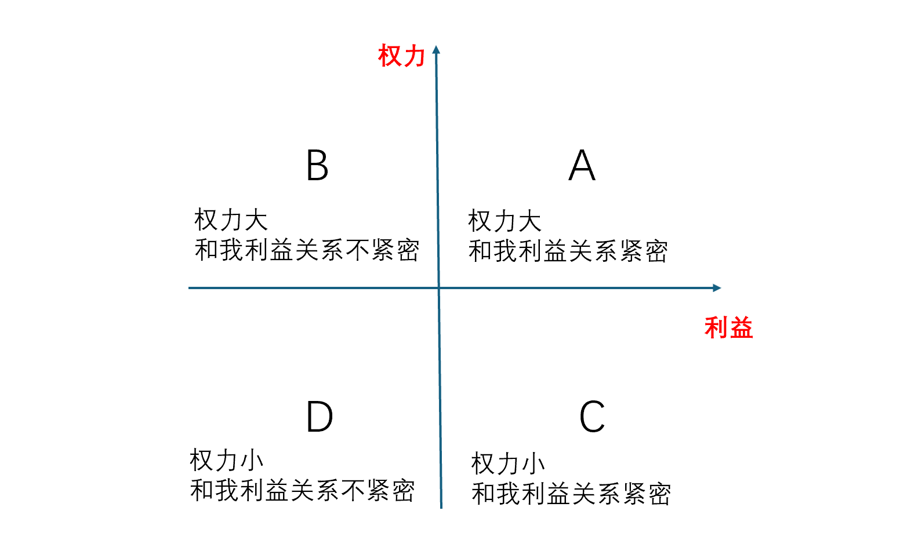
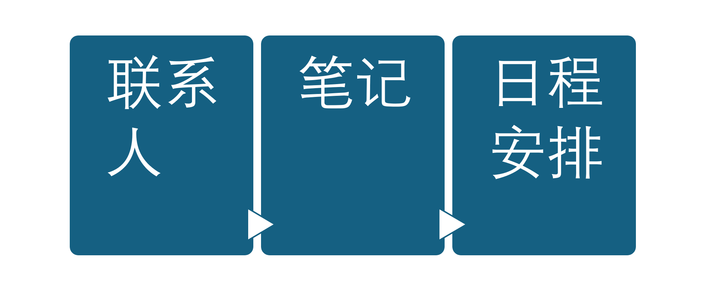
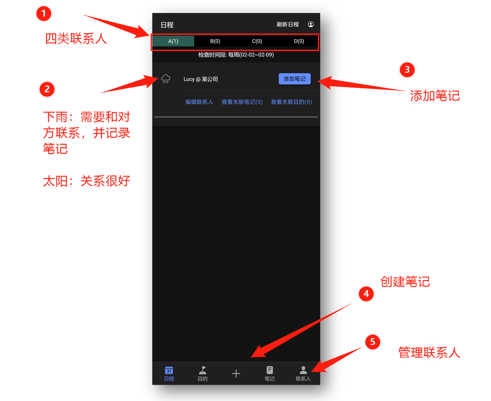
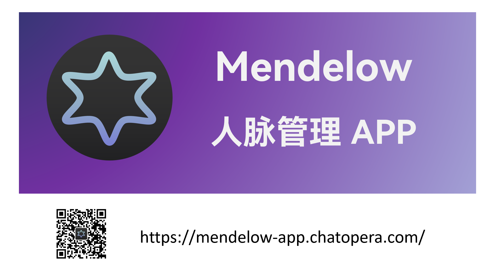

# 第一次了解 Mendelow 方法论

2021 年 10 月 8 日，一个慵懒困顿的午后，我在网络上浏览网页，无意间打开一个讲沟通技巧的文章 - [《在科技公司里有效沟通 | 亚马逊华人Biz Tech Lead二十年工作经验精华总结 | 打破“竹子天花板“必修课》](https://cn.linkedin.com/posts/yuzhengsun_%E7%A7%91%E6%8A%80%E5%85%AC%E5%8F%B8%E9%87%8C%E5%A6%82%E4%BD%95%E8%BF%9B%E8%A1%8C%E6%9C%89%E6%95%88%E6%B2%9F%E9%80%9A-%E4%BA%9A%E9%A9%AC%E9%80%8A%E5%8D%8E%E4%BA%BAbiz-tech-lead%E4%BA%8C%E5%8D%81%E5%B9%B4%E5%B7%A5%E4%BD%9C%E7%BB%8F%E9%AA%8C%E7%B2%BE%E5%8D%8E%E6%80%BB%E7%BB%93-activity-6679463660982808576-re18)。这个话题非常吸引我，因为沟通能力太重要了，如何让自己的沟通能力更好、更有效率、如何维护很多很好的朋友，是我需要不断学习的。这篇文章是关于对亚马逊一位商务及技术领导 Eugene Wang 的讲座分享 [^link1] 总结，在这篇文章中，我学习到了一个方法论 - Mendelow Stakeholders Matrix / Mendelow 利益相关者矩阵。

<!-- more -->

# 什么是 Mendelow 利益相关者矩阵

利益相关者（Stakeholders）就是和我们切身利益相关的人，不管是个人，还是企业，都是和外界保持多种多样的联系，只有这些联系维护好，个人或企业的利益才能得到保证，才能稳定存在下去。直白的说，这些关系都是和“收入”有关，所以叫利益相关者。对于个人来说，就包括工作上的同事、生意上的伙伴、同学老乡等等；对于企业来说，就是客户、政府关系、上下游企业等等。

Mendelow 利益相关者矩阵就是将这些联系人分类，不同类别投入相应的精力进行维护。Mendelow 利益相关者矩阵的微妙之处就在于如何分类 - Mendelow 将利益相关者按照【权力-利益】象限。

| 分类 | 分类方法 | 联系策略 |
| --- | --- | --- |
| A | 紧密合作者，他[^ta]好我就好，我好他也好。有权利和资源。我们俩利益一致。 | **高频联系**，比如每周 |
| B | 利益相关者，他的权力大，但是并不在乎我好不好。是我争取的对象，至少不要引起对方的对抗。 | **积极联系**，比如每月联系一次  | 
| C | 知情者，权力小，我们俩利益一致。是利益共同体。 | **定期同步**，比如每季度同步一次 | 
| D | 普通联系人，没有权力也和我没有共同利益。| **关注**，比如半年联系 |

# 个人如何使用 Mendelow 理念维护联系人

对于企业，已经有很多成熟的产品，尤其是 CRM 作为一个很大的软件产品是很多公司的旗舰产品，比如 SalesForce，做的规模很大，因为每个企业在发展过程中，都需要不断优化客户关系管理。SalesForce 等 CRM 产品，就融入了大量 Mendelow 理念。

可是，个人或者小公司业务的负责人，怎么用好 Mendelow 来维护好关系呢？这么好的理念，咱们得利用起来，从中获益啊。

在使用和实践了不同的方案以后，我发现：

* 要用一个 APP 在手机上完成，随时随地的完成记录，大脑记累
* 要用软件智能生成联系计划，这样按照提示进行联系，工作量大大降低

这个事情，一直到 2025 年我都没有找到好的方案，也因此没有实践 Mendelow 理念成功，2025 年 11 月，近乎执念的，我决定开发一个 APP 来达到理想的应用，这个应用就是 - [Mendelow App](https://mendelow-app.chatopera.com/#/tabs/pipeline)。

Mendelow App 的设计，是围绕**联系人**，给联系人创建笔记，然后根据联系人的**联系级别（ABCD）**，以及最近的相关**笔记**的时间，生成**日程安排**。

在具体设计上，Mendelow App 做到了简洁高效，充分的发挥 Mendelow 理念。

* 日程安排

* 撰写笔记

# 用心关照关心伙伴

在使用 Mendelow App 以后，我发现真的很受益，打开应用，我就知道该和谁沟通，积极主动地去关心伙伴、朋友。让我的时间得到充分的利用，营造了更好的社会关系。

有很多人个性就喜欢联系朋友，走动社交关系，这促成了他们事业、生活上的成功。邀请更多人来使用 Mendelow App 主要是帮助那些不善于社交，想要改善社会关系的人，因为人际关系很重要。

让我们用心去关照、关心伙伴。

[^ta]: 代表男性他和未知性别(模糊称谓，包括男性和女性的第三人称，全文同)。
[^link1]: 在科技公司里有效沟通 | 亚马逊华人Biz Tech Lead二十年工作经验精华总结 | 打破“竹子天花板“必修课，https://www.youtube.com/watch?v=HAQ4p74KbdY 